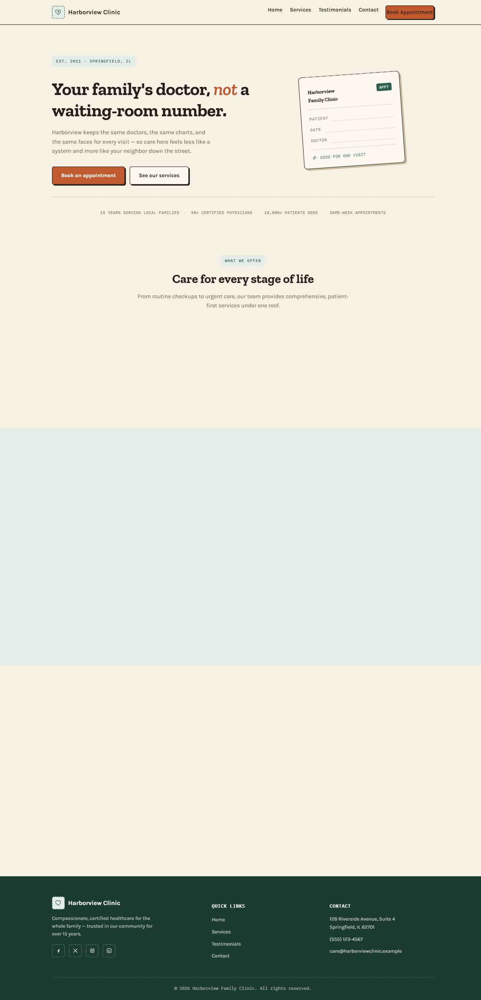

# Harborview Family Clinic

A single-page marketing and appointment-request site for Harborview Family Clinic, a fictional healthcare practice built for demonstration purposes.

**Live site:** https://nlimem70.github.io/Healthcare/



## What this is

Everything — markup, styles, and behavior — lives in one self-contained [index.html](index.html):

- Sticky navbar with a mobile hamburger menu
- Hero section with a booking call-to-action
- Services grid, patient testimonial cards, and a footer
- An appointment enquiry form with client-side validation (no backend — form data is logged to the console on submit)

## Running locally

There's no build step and no dependencies. Just open the file in a browser:

```powershell
Start-Process "index.html"
```

or double-click `index.html` in a file explorer.

## Deployment

Pushes to `main` trigger a GitHub Actions workflow ([.github/workflows/deploy-pages.yml](.github/workflows/deploy-pages.yml)) that publishes `index.html` to GitHub Pages.
